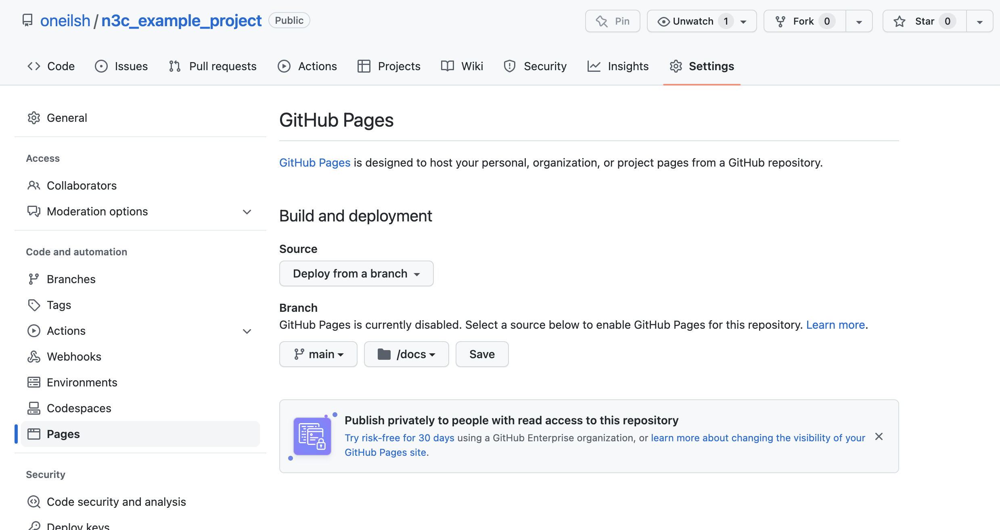

# Code Workbooks Parser

This small utility is developed for [N3C](https://covid.cd2h.org), to help 
researchers publish code from Code Workbooks to git repositories in more browsable way.

#### Features

* Export each transform node as an independent code file
* Creates an SVG-based browsable graph of the transform nodes with customization options
* Supports multiple code workbooks

#### Known Issues

* The code could be more robust to non-conforming inputs
* Requires a Unix-like environment with `sed`, `awk`, and `bash`
* Each transform should be annotated by the user as python, R, or sql, when this could be derived automatically
* For pipelines spanning multiple workbooks, information on which workbook each transform derives from is dropped

All of the above could be solved by migrating all of the logic entirely to python -- pull requests welcome :)

#### Future Ideas

Additional metadata fields could be parsed and added to the visualization or outputs. Ideas include
metadata on inputs, for example subfields of each input that describe the columns expected and their types,
and/or integrated metadata on transform output. 

It would also be nice to use github actions to re-build the parsed output and host it via github pages 
on push. Early work on this exists in `utils/github`. 

Support for parsing Code Repo exports would allow the use of parsed Repos and Workbooks in a single project.

## Requirements

To make this utility work, you will need the following:

* [Graphviz](https://graphviz.org/)
* GNU tools: `awk`, `sed`, and `bash`
* python3, and the following python packages:
  * [graphviz](https://pypi.org/project/graphviz/)
  * [pyyaml](https://pypi.org/project/PyYAML/)

# Example Usage

## Add Metadata to Workbook Transforms

To start, you will need to add metadata to transforms in Code Workbooks you wish to parse and publish. 
Here are two workbooks we'll use as examples: [workbook1](https://unite.nih.gov/workspace/vector/view/ri.vector.main.workbook.dde3a2a4-7f3c-4c51-99dc-50dcff82fbe9?branch=master) and [workbook2](https://unite.nih.gov/workspace/vector/view/ri.vector.main.workbook.a0526ea9-8d77-43bd-94b3-9f589e307129?branch=master) (N3C enclave access required).

Here's a screenshot from `workbook1`, illustrating the minimal suggested metadata requirement for an `sql` node:


Notice that the first section of the transform is a set of special comment lines, each beginning with `--* ` (two hyphens, a star, and a space). This 
block defines the metadata for the transform using SQL comments (`--`). For R and Python nodes, the metadata blocks
begin with `#* `. The R node in `workbook1` illustrates this with more options set.


**Note**: Don't get fancy with the formatting of this metadata block. In the current implementation the block should:

* Be the first lines of the transform (lines prior will be ignored)
* Be contiguous (not contain any empty lines)
* Be valid [YAML](https://en.wikipedia.org/wiki/YAML) after the special comment characters and space

**Note 2**: All transforms in your code workbook(s) should have metadata blocks. Missing some will result in lack
of output for those nodes and unconnected parts of the pipeline visualization.

### Metadata Fields

The following fields are supported and illustrated in the second screenshot above:

* **Node name (e.g. `plot_person:` above)** Metadata must live under a heading defining the name of the node. 
  This can be anything you like, but note that it must be a valid YAML field name (no spaces), and it will
  be the name used to refer to this node as an input to other nodes. We recommend 
  using `snake_case` names for your transforms, both in the name of the saved dataset 
  and in-workbook transform name (`plot_person` as `plot_person` in the screenshot above).

* **`inputs:`** Required (unless you have a transform with no inputs for some reason...). It should
  be a YAML list of node names that are inputs to this node.

* **`desc:`** Recommended. This should be a short description for the node, and will be used as hoverover text in
  the output visualization. To conform to YAML standard you may need to wrap it in quotes (as above). You could also
  use YAML multi-line strings, for example:

  ```
  #* some_transform:
  #*   desc: |
  #*     This is a multiline
  #*     string in YAML. 
  #*   inputs:
  #*     - ...
  ```

  Note that when using multi-line strings your line breaks will be preserved, but additional line breaks may
  also be added by the browsers hover-text.

* **`ext:`** Recommended. This should be one of `py`, `R`, or `sql` to alert the parser to what kind
  of transform is being parsed. This is used to set the filename in the per-transform code output, and 
  the color of the node in the visualization.

* **`attr:`** Optional. This field can be used to specify additional visualization settings for 
  the node as `attribute: value` pairs referring to graphviz [node attributes](https://graphviz.org/docs/nodes/). 
  All attributes should be supported, with the exception of `tooltip` which is instead specified by `desc` above. 
  For example, to change the node to use a hexagon shape, blue fill, and font size of 20:

  ```
  #* some_transform:
  #*   attr:
  #*     fillcolor: blue
  #*     shape: hexagon
  #*     fontsize: "20"
  #*   inputs:
  #*     - ...
  ```

  Note that numeric values (like font size) should be specified as strings enclosed in quotes. You can use
  RGB values by enclosing them in quotes as well, e.g. `"#25EF34"`. The standard color scheme uses the
  Colorbrewer [set3, 9 class](https://colorbrewer2.org/#type=qualitative&scheme=Set3&n=9) palette, so you can also 
  use e.g. `fillcolor: "7"` to use the 7th color in this colorscheme. 


## Project Setup, Initially Cloning Workbooks

For this section we'll assume you are somewhat familiar with working with GitHub and a Unix-based command-line
environment. 

First, create a [new repository](https://docs.github.com/en/get-started/quickstart/create-a-repo) on GitHub to represent your project, with or without a README.md, and clone it to your
local machine, and then change to the repo directory:

```
git clone https://github.com/oneilsh/n3c_example_project.git
cd n3c_example_project
```

Now we need to clone the Code Workbooks from the Enclave. For each
workbook, select the "gear" icon near the top, and then "Export git repository". 
This will open a new browser tab, with a command to run to clone the workbook. 
**But**, because we are placing a git repository (the workbook) inside of another
(the project), we need to modify the command to add the URL as a git submodule.
Each URL is unique to your account, so we don't show it below, but we clone down
the two example workbooks:

```
git submodule add <long URL provided for workbook1>
git submodule add <long URL provided for workbook2>
``` 

We are also going to need this `workbook_parser` tooling, which we may as well
store as a submodule too:

```
git submodule add https://github.com/oneilsh/n3c_workbook_parser.git
```

Now we can run the workbook parser. The two arguments are the directory to look for workbook files in (`.` for the current
project directory), and the output folder to place results in (`docs` in this case):

```
n3c_workbook_parser/parse_workbooks . docs
```

At this point we have a variety of subfolders: the two workbook folders `workbook1` and `workbook2`, the `n3c_workbook_parser`
utility folder, and the `docs` output folder with individual code files for each transform and an `index.html` that you can 
open to browse the transforms.

```
.
├── README.md
├── docs
│   ├── index.html
│   ├── input_concept_set_members.sql
│   ├── plot_person.R
│   ├── pneumonia_concept_set.sql
│   ├── pneumonia_conditions.sql
│   └── pneumonia_expired_demographics.py
├── n3c_workbook_parser
│   ├── README.md
│   ├── docs_images
│   │   ├── input_concept_set_members.png
│   │   └── plot_person.png
│   ├── parse_workbooks
│   └── utils
│       ├── github
│       │   ├── README.md
│       │   └── workflows
│       │       └── runparser.yml
│       ├── meta2yaml.sh
│       ├── parse_yaml_html.py
│       └── strip_extraneous.awk
├── workbook1
│   ├── pipeline.R
│   ├── pipeline.py
│   ├── pipeline.sql
│   └── workbook.yml
└── workbook2
    ├── pipeline.R
    ├── pipeline.py
    ├── pipeline.sql
    └── workbook.yml

8 directories, 24 files
```

Because the output is saved as html in the docs directory, it is easy to create a 
browsable page for the project. First we push all these changes up to GitHub

```
git add -A
git commit -m "Adding workbooks, parser, parsed results"
git push
```

On GitHub, we can configure the repo pages under Settings -> Pages, 
and select the `main` branch `docs` subfolder.




