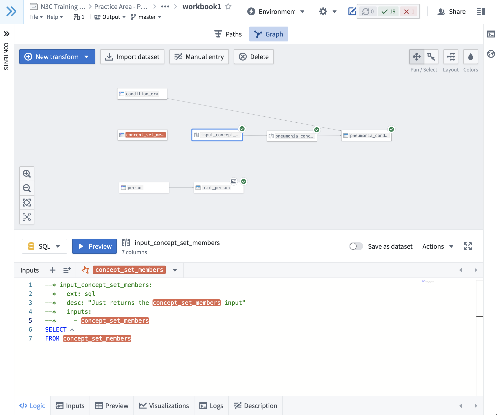
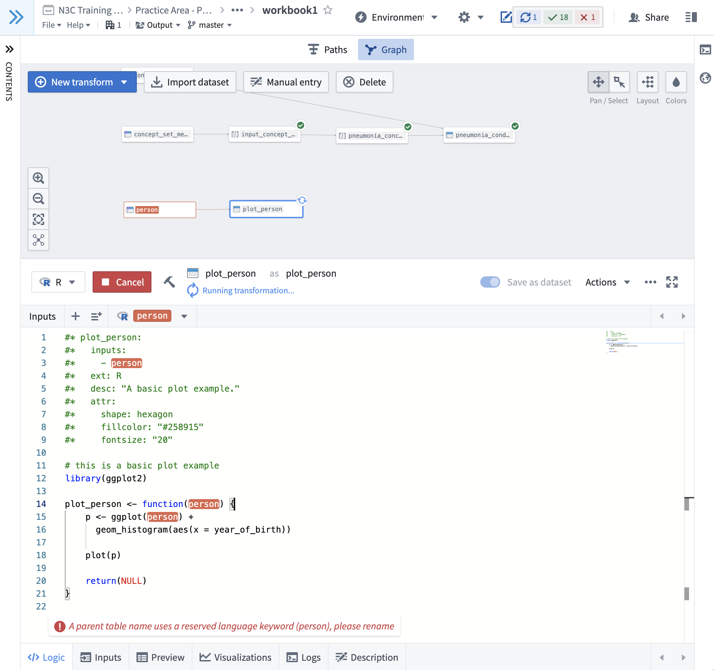

# Code Workbooks Parser

This small utility is developed for [N3C](https://covid.cd2h.org), to help 
researchers publish code from Code Workbooks to git repositories in more browsable way.

#### Features:

* Export each transform node as an independent code file
* Creates an SVG-based browsable graph of the transform nodes with customization options
* Supports multiple code workbooks

#### Known Issues:

* The code could be more robust to non-conforming inputs
* Requires a Unix-like environment with `sed`, `awk`, and `bash`
* Each transform should be annotated by the user as python, R, or sql, when this could be derived automatically
* For pipelines spanning multiple workbooks, information on which workbook each transform derives from is dropped

All of the above could be solved by migrating all of the logic entirely to python -- pull requests welcome :)

## Requirements

To make this utility work, you will need the following:

* [Graphviz](https://graphviz.org/)
* GNU tools: `awk`, `sed`, and `bash`
* python3, and the following python packages:
  * [graphviz](https://pypi.org/project/graphviz/)
  * [pyyaml](https://pypi.org/project/PyYAML/)

## Example Usage

To start, you will need to add metadata to transforms in Code Workbooks you wish to parse and publish. 
Here are two workbooks we'll use as examples: [workbook1](https://unite.nih.gov/workspace/vector/view/ri.vector.main.workbook.dde3a2a4-7f3c-4c51-99dc-50dcff82fbe9?branch=master) and [workbook2](https://unite.nih.gov/workspace/vector/view/ri.vector.main.workbook.a0526ea9-8d77-43bd-94b3-9f589e307129?branch=master) (N3C enclave access required).

Here's a screenshot from `workbook1`, illustrating the minimal suggested metadata requirement for an `sql` node:

Notice that the first section of the transform is a set of special comment lines, each beginning with `--* ` (two hyphens, a star, and a space). This 
block defines the metadata for the transform using SQL comments (`--`). For R and Python nodes, the metadata blocks
begin with `#* `. The R node in `workbook1` illustrates this with more options set.

**Note**: Don't get fancy with the formatting of this metadata block. In the current implementation the block should:

* Be the first lines of the transform (lines prior will be ignored)
* Be contiguous (not contain any empty lines)
* Be valid [YAML](https://en.wikipedia.org/wiki/YAML) after the special comment characters and space

## Metadata Fields

The following fields are supported and illustrated in the second screenshot above:

* **Node name (e.g. `plot_person:` above)** Metadata must live under a heading defining the name of the node. 
  This can be anything you like, but note that it must be a valid YAML field name (no spaces), and it will
  be the name used to refer to this node as an input to other nodes. We recommend 
  using `snake_case` names for your transforms, both in the name of the saved dataset 
  and in-workbook transform name (`plot_person` as `plot_person` in the screenshot above).

* **`inputs:`** This field is required (unless you have a transform with no inputs for some reason...). It should
  be a YAML list of node names that are inputs to this node.

